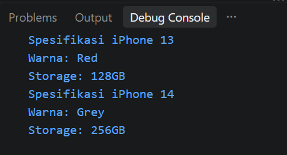
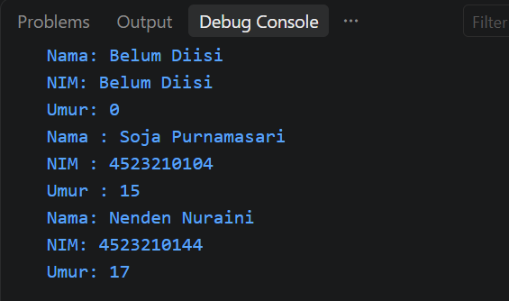
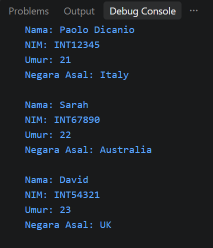
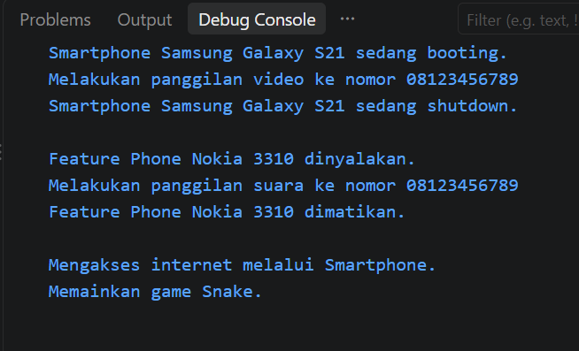
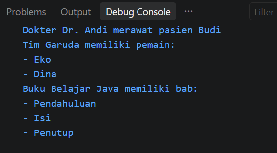
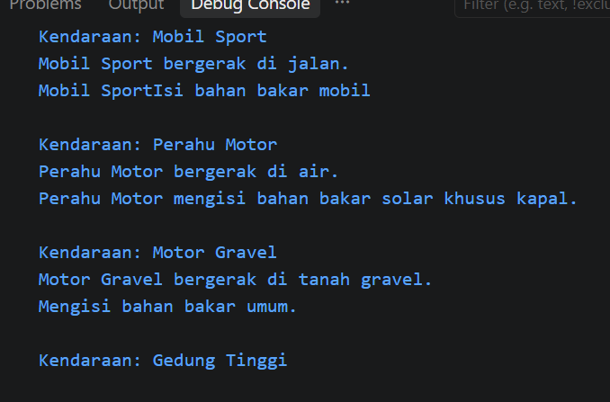

# Tugas PBO A - Konversi Java ke PHP

**Nama:** Nevilla Ghilar Apryanti  
**NIM:** 4525210054

## Deskripsi

Project ini merupakan tugas PBO yang berisi konversi program dari **Java ke PHP**. Program yang sebelumnya dibuat menggunakan Java dibuat kembali menggunakan bahasa PHP dengan menerapkan konsep dasar Pemrograman Berorientasi Objek (OOP).

Konsep yang digunakan yaitu Class, Constructor, Inheritance, Polymorphism, Asosiasi dan Komposisi, serta Abstract Class dan Interface.

## Materi

### 1. Class

Berisi contoh penggunaan class dan object pada PHP.

Folder yang digunakan:

    01_Class

### 2. Constructor

Berisi penggunaan constructor untuk memberikan nilai awal pada object.

Folder yang digunakan:

    02_Constructor

### 3. Inheritance

Berisi contoh pewarisan class menggunakan `extends`.

Folder yang digunakan:

    03_Inheritance

### 4. Polymorphism

Berisi contoh polymorphism dengan class `Handphone`, `Smartphone`, dan `FeaturePhone`.

Folder yang digunakan:

    04_Polymorphism

### 5. Asosiasi dan Komposisi

Berisi contoh hubungan antar-object seperti Dokter dan Pasien, Tim dan Pemain, serta Buku dan Bab.

Folder yang digunakan:

    05_Asosiasikomposisi

### 6. Abstract Class dan Interface

Berisi penggunaan abstract class dan interface pada beberapa class seperti `Vehicle`, `Car`, `Motor`, dan `Boat`.

Folder yang digunakan:

    06_Abstractinterface

## Struktur Folder

    PHP/
    ├── 01_Class/
    │   ├── iPhone.php
    │   └── Main.php
    │
    ├── 02_Constructor/
    │   ├── Aplikasi.php
    │   └── Mahasiswa.php
    │
    ├── 03_Inheritance/
    │   ├── App.php
    │   ├── BangunDatar.php
    │   ├── Lingkaran.php
    │   ├── Mahasiswa.php
    │   ├── MahasiswaInternational.php
    │   ├── Main.php
    │   ├── Persegi.php
    │   └── Segitiga.php
    │
    ├── 04_Polymorphism/
    │   ├── FeaturePhone.php
    │   ├── Handphone.php
    │   ├── Main.php
    │   └── Smartphone.php
    │
    ├── 05_Asosiasikomposisi/
    │   ├── Bab.php
    │   ├── Buku.php
    │   ├── Dokter.php
    │   ├── Main.php
    │   ├── Pasien.php
    │   ├── Pemain.php
    │   └── Tim.php
    │
    └── 06_Abstractinterface/
        ├── Boat.php
        ├── Building.php
        ├── Car.php
        ├── Fuelable.php
        ├── Main.php
        ├── Motor.php
        ├── Movable.php
        └── Vehicle.php

## Perbedaan Java dan PHP

| Java | PHP |
|---|---|
| `System.out.println()` | `echo` |
| Constructor menggunakan nama class | `__construct()` |
| `extends` | `extends` |
| `implements` | `implements` |
| `.java` | `.php` |

## Cara Menjalankan

Pastikan PHP sudah terinstall dan sudah masuk ke PATH.

Untuk mengecek PHP, buka terminal lalu jalankan:

    php --version

Jika versi PHP sudah muncul, program dapat dijalankan melalui terminal.

### Class

    cd PHP/01_Class
    php Main.php

### Constructor

    cd PHP/02_Constructor
    php Aplikasi.php

### Inheritance

    cd PHP/03_Inheritance
    php Main.php

### Polymorphism

    cd PHP/04_Polymorphism
    php Main.php

### Asosiasi dan Komposisi

    cd PHP/05_Asosiasikomposisi
    php Main.php

### Abstract Class dan Interface

    cd PHP/06_Abstractinterface
    php Main.php

## Screenshot Hasil Running

### Class

### Constructor

### Inheritance

### Polymorphism

### Asosiasi dan Komposisi

### Abstract Class dan Interface

## Kesimpulan

Program Java berhasil dikonversi ke PHP dengan tetap menggunakan konsep OOP seperti class, constructor, inheritance, polymorphism, asosiasi, komposisi, abstract class, dan interface. Perbedaan utama terdapat pada sintaks yang digunakan oleh Java dan PHP.